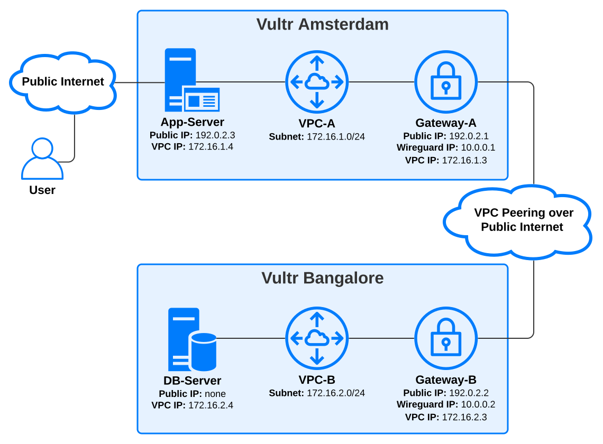
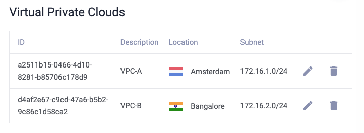
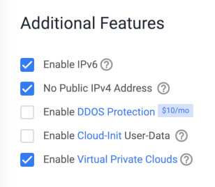
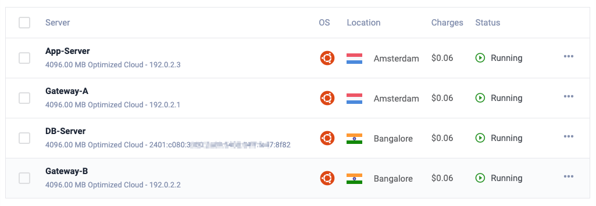
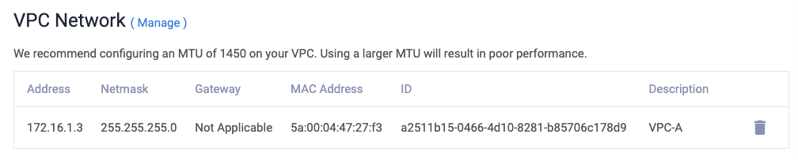

# How to Peer VPCs between Vultr Locations with Wireguard

*By Diego Murray and David Finster, Vultr*  

## Introduction

A virtual private cloud (VPC) is a private network where you can deploy cloud servers, cloud GPUs, load balancers, and other Vultr resources to protect their network traffic. A VPC exists in a single Vultr location and cannot communicate with the internet or other VPCs. However, you can use VPN gateways to create a **VPC peering** connection between different locations, allowing them to communicate securely with each other.

VPC peering can improve security and flexibility in your network architecture. Notably, it's possible to deploy servers in a VPC with no public IP address while allowing them to communicate securely over the peering connection. This guide includes a practical example of that scenario.

> This guide describes how to peer VPCs in **different locations**. If you want to peer VPCs in the **same location**, Vultr has a simple solution that doesn't require deploying gateway servers. Please see this [VPC Peering guide](https://www.vultr.com/docs/vpc-peering/) to learn more.

### Table of Contents

* [Introduction](#introduction)
* [Overview](#overview)
* [Getting Started](#getting-started)
* [Section 1: Create the VPCs](#section-1-create-the-vpcs)
* [Section 2: Deploy Servers and Gateways](#section-2-deploy-servers-and-gateways)
* [Section 3: Install Wireguard](#section-3-install-wireguard)
* [Section 4: Configure the VPN](#section-4-configure-the-vpn)
* [Section 5: Configure App-Server and DB-Server](#section-5-configure-app-server-and-db-server)
* [Section 6: Final Tests](#section-6-final-tests)
* [Next Steps: Expanding the Network](#next-steps-expanding-the-network)
* [More Information](#more-information)

## Overview

Before you begin, it's helpful to visualize the complete scenario. By following the steps in this guide, you'll create the following resources and connections:

* Two VPCs, one each in Amsterdam and Bangalore
* Two Wireguard gateways that peer the VPCs over a site-to-site VPN
* An application server in Amsterdam
* A database server in Bangalore without a public IP address

After you finish these steps, users can connect to App-Server, which in turn connects to DB-Server over the peering connection, even though the database is completely isolated from the public internet.

## Getting Started

Please review these tutorial notes before following this guide.

* **Note the server names** in the code examples. Because you'll make multiple SSH connections to different servers and run similar commands with different details for each, we've prefixed all commands in this guide with the server name for clarity.

* **You must change the public IPs** with your servers' actual public IPs, which you'll find in the Vultr customer portal after you deploy them. The public IPs in this guide are [documentation examples](https://www.rfc-editor.org/rfc/rfc5737.html).

* **You don't need to change the VPC and Wireguard IPs**; these are valid [RFC1918 private addresses](https://www.rfc-editor.org/rfc/rfc1918). If you prefer a different address scheme or these examples conflict with your existing infrastructure, choose your VPC and Wireguard IPs from the RFC1918 ranges.

Here's a summary table of the IPs used in this guide.
<table>
<tr>
<th>Amsterdam</th><th>Bangalore</th>
</tr>
<tr>
<td valign="top" align="center">

**VPC-A** subnet is **172.16.1.0/24**.
</td>
<td valign="top" align="center">

**VPC-B** subnet is **172.16.2.0/24**.

</td>
</tr>
<tr>
<td valign="top" align="center">

#### Gateway-A

| Interface            | IP Address    |
|:---------------------|:--------------|
| Public               | 192.0.2.1     |
| VPC                  | 172.16.1.3    |
| Wireguard            | 10.10.0.1      |

</td>
<td valign="top" align="center">

#### Gateway-B

| Interface            | IP Address    |
|:---------------------|:--------------|
| Public               | 192.0.2.2     |
| VPC                  | 172.16.2.3    |
| Wireguard            | 10.10.0.2      |

</td>
</tr>
<tr>
<td valign="top" align="center">

#### App-Server

|  Interface           | IP Address    |
|:---------------------|:--------------|
| Public               | 192.0.2.3     |
| VPC                  | 172.16.1.2    |

</td>
<td valign="top" align="center">

#### DB-Server

|  Interface           | IP Address    |
|:---------------------|:--------------|
| Public               | none          |
| VPC                  | 172.16.2.2    |

</td>
</tr>
</table>

## Section 1: Create the VPCs

In this step, you'll create the VPCs in each location.

### Create VPC-A in Amsterdam

1. Follow this link to [add a VPC Network](https://my.vultr.com/network/vpc/add/).
1. Choose the **Amsterdam** location.
1. In the Configure IP Range section, choose **Manual - Advanced** to open the **Set IP Range** section.
1. Enter `172.16.1.0` in Network Address.
1. Enter `24` in Network Prefix.
1. In the Manage Routes section, choose **No Routes**.
1. Enter `VPC-A` for the network name, then click **Add Network**.

### Create VPC-B in Bangalore

These are the exact steps you did for VPC-A, except the network subnet and location are different.

1. Follow this link to [add a VPC Network](https://my.vultr.com/network/vpc/add/).
1. Choose the **Bangalore** location.
1. In the Configure IP Range section, choose **Manual - Advanced** to open the **Set IP Range** section.
1. Enter `172.16.2.0` in Network Address.
1. Enter `24` in Network Prefix.
1. In the Manage Routes section, choose **No Routes**.
1. Enter `VPC-B` for the network name, then click **Add Network**.

When finished, you'll have two VPCs, like this:

## Section 2: Deploy Servers and Gateways

In this step, you'll deploy the servers and gateways.

### Deploy the Amsterdam Servers

Follow these steps to deploy two identical servers in Amsterdam.

1. Follow this link to [deploy a new server](https://my.vultr.com/deploy/).
1. Select **Optimized Cloud Compute - General Purpose**.
1. Choose the **Amsterdam** location.
1. Choose the **Ubuntu 22.04 LTS x64** operating system.
1. Choose the **30 GB NVMe** server size.
1. In the Additional Features section, select **Enable Virtual Private Clouds**.
1. You can choose an SSH key if you have one available. Or, you can use the root password you'll find on the server overview page after deployment.
1. Choose `2` in the **Servers Qty** field at the bottom of the screen.
1. Enter `Gateway-A` in the **Server 1 Hostname & Label** section.
1. Enter `App-Server` in the **Server 2 Hostname & Label** section.
1. Click **Deploy Now**.

### Deploy the Bangalore Servers

For demonstration, DB-Server in Bangalore has no public IP address. Because it has a different configuration than Gateway-B, you'll deploy these servers simultaneously.

#### Deploy Gateway-B

1. Follow this link to [deploy a new server](https://my.vultr.com/deploy/).
1. Select **Optimized Cloud Compute - General Purpose**, unless you have different performance requirements.
1. Choose the **Bangalore** location.
1. Choose the **Ubuntu 22.04 LTS x64** operating system.
1. Choose the **30 GB NVMe** server size.
1. In the Additional Features section, select **Enable Virtual Private Clouds**.
1. You can choose an SSH key if you have one.
1. Enter `Gateway-B` in the **Server Hostname & Label** section.
1. Click **Deploy Now**.

#### Deploy DB-Server

DB-Server has no public IP address and is only reachable through the VPC, so the steps differ slightly from the previous three deployments.

1. Follow this link to [deploy a new server](https://my.vultr.com/deploy/).
1. Select **Optimized Cloud Compute - General Purpose**.
1. Choose the **Bangalore** location.
1. Choose the **Ubuntu 22.04 LTS x64** operating system.
1. Choose the **30 GB NVMe** server size.
1. In the Additional Features section:

    * Select **No Public IPv4 Address**.
    * Select **Enable Virtual Private Clouds**.

    The Additional Features section looks like this after your selections:

    

1. Enter `DB-Server` in the **Server Hostname & Label** section.
1. Click **Deploy Now**.

### Confirm the Server Configuration

You should now have four servers deployed. The overview page shows the servers and their public IP addresses.

Make a note of the public addresses for the two gateways and App-Server.

Because you created the VPCs before deploying the servers, Vultr could automatically configure each server's private network adapter [with cloud-init](https://www.vultr.com/docs/how-to-deploy-a-vultr-server-with-cloudinit-userdata/).

To confirm the VPC network configuration for each server:

1. Click the server entry to view its overview page.
1. Click the **Settings tab**.
1. Click the **IPv4** menu and scroll to the **VPC Network** section, which looks like this:

Verify all servers have their VPCs configured and note the addresses before proceeding.

## Section 3: Install Wireguard

In this section, you'll install Wireguard on both gateways. 

> Follow these steps for **Gateway-A**, then repeat the same steps on **Gateway-B** before proceeding to the next section.

1. From your local workstation, open a terminal and SSH to the server as the root user.

        user@localhost:~$ ssh root@192.0.2.1

1. [Update](https://www.vultr.com/docs/how-to-update-a-vultr-cloud-server/#How_to_Update_Debian___Ubuntu) the server.

        Gateway-A:# apt update && apt upgrade -y

1. Reboot the server to ensure all updates are applied, then reconnect with SSH.

        Gateway-A:# reboot
        Gateway-A:# Connection to 192.0.2.1 closed by remote host.

        user@localhost:~$ ssh root@192.0.2.1

        Gateway-A:#

1. Install Wireguard.

        Gateway-A:# apt install wireguard

1. Create Wireguard's **private** key.

        Gateway-A:# wg genkey | sudo tee /etc/wireguard/private.key

1. Create Wireguard's **public** key.

        Gateway-A:# cat /etc/wireguard/private.key | wg pubkey | sudo tee /etc/wireguard/public.key

1. View the keys with `cat`, and make a note of them. This guide uses example values for clarity.

        Gateway-A:# cat /etc/wireguard/private.key
        GATEWAY-A-PRIVATE-KEY-EXAMPLE

        Gateway-A:# cat /etc/wireguard/public.key
        GATEWAY-A-PUBLIC-KEY-EXAMPLE

1. **Repeat these steps on Gateway-B** and make a note of its public and private keys before proceeding to the next section.

## Section 4: Configure the VPN

In this section, you'll create a Wireguard interface on each machine and configure it with the remote gateway's address and public/private key information.

### Configure Gateway-A

1. SSH to Gateway-A.

        user@localhost:~$ ssh root@192.0.2.1

1. Create the Wireguard configuration file. The Wireguard interface takes its name from the filename, and the standard convention is to name the first Wireguard interface `wg0`.

        Gateway-A:# nano /etc/wireguard/wg0.conf

1. Copy these settings into `wg0.conf`. You can also [download the file here](Gateway-A/wg0.conf).

        # Local Settings - Gateway-A
        [Interface]
        PrivateKey = GATEWAY-A-PRIVATE-KEY-EXAMPLE
        Address = 10.10.0.1/32 # Gateway-A Wireguard address
        ListenPort = 51820

        # Firewall Rules
        PreUp = ufw allow 51820/udp
        PostDown = ufw delete allow 51820/udp

        # IP forwarding
        PreUp = sysctl -w net.ipv4.ip_forward=1

        # Remote Settings - Gateway-B
        [Peer]
        PublicKey = GATEWAY-B-PUBLIC-KEY-EXAMPLE
        Endpoint = 192.0.2.2:51820 # Gateway-B public IP and port
        AllowedIPs = 10.10.0.2/32, 172.16.2.0/24 # Gateway-B Wireguard IP, VPC-B subnet

1. Change this example file:

    * Under **# Local Settings - Gateway-A**:
      * Change `PrivateKey` to Gateway-A's private key.
      * Verify `Address` is the correct Wireguard IP address for Gateway-A. If you've followed the Wireguard and VPC addressing scheme from this guide, you won't need to change this.
    * Under **# Remote Settings - Gateway-B**:
      * Change `PublicKey` to Gateway-B's public key.
      * Change `Endpoint` to Gateway-B's public IP address, followed by `:51820` to indicate the remote port.
      * Verify `AllowedIPs` matches Gateway-B's Wireguard IP and VPC-B subnet. If you've followed the Wireguard and VPC addressing scheme from this guide, you won't need to change these.

    These other settings rarely need to be changed:

    * Under `# Firewall Rules`:
      * `PreUp` commands run before Wireguard brings up the tunnel. Here, it opens the firewall port `51820/udp`.
      * `PostDown` commands run after Wireguard brings down the tunnel. Here, it closes the firewall port.
    * Under `# IP forwarding`:
      * This `PreUp` setting enables IP forwarding, which allows packets from the VPN tunnel to be passed to the VPC interface.

1. Save and exit the file.
1. Start the Wireguard service.

        Gateway-A:# systemctl start wg-quick@wg0.service

1. Enable the Wireguard service to restart after the server reboots.

        Gateway-A:# systemctl enable wg-quick@wg0.service

Gateway-A is now waiting for Gateway-B to come online, which you'll do in the next step.

### Configure Gateway-B

Next, you'll connect to Gateway-B to configure the other end of the tunnel. These steps are similar to the ones you did for Gateway-A, but the addresses and keys differ.

1. SSH to Gateway-B.

        user@localhost:~$ ssh root@192.0.2.2

1. Create the `wg0.conf` configuration file.

        Gateway-B:# nano /etc/wireguard/wg0.conf

1. Copy these settings into `wg0.conf`. You can also [download the file here](Gateway-B/wg0.conf).

        # Local Settings - Gateway-B
        [Interface]
        PrivateKey = GATEWAY-B-PRIVATE-KEY-EXAMPLE
        Address = 10.10.0.2/32 # Gateway-B Wireguard address
        ListenPort = 51820

        # Firewall Rules
        PreUp = ufw allow 51820/udp
        PostDown = ufw delete allow 51820/udp

        # IP forwarding
        PreUp = sysctl -w net.ipv4.ip_forward=1

        # Remote Settings - Gateway-A
        [Peer]
        PublicKey = GATEWAY-A-PUBLIC-KEY-EXAMPLE
        Endpoint = 192.0.2.1:51820 # Gateway-A public IP and port
        AllowedIPs = 10.10.0.1/32, 172.16.1.0/24 # Gateway-A Wireguard IP, VPC-A subnet

1. Change this example file:

    * Under **# Local Settings - Gateway-B**:
      * Change `PrivateKey` to Gateway-B's private key.
      * Verify `Address` is the correct Wireguard IP address for Gateway-B. If you've followed the Wireguard and VPC addressing scheme from this guide, you won't need to change this.
    * Under **# Remote Settings - Gateway-A**:
      * Change `PublicKey` to Gateway-A's public key.
      * Change `Endpoint` to Gateway-A's public IP address, followed by `:51820` to indicate the remote port.
      * Verify `AllowedIPs` matches Gateway-A's VPN endpoint and VPC-A subnet. If you've followed the Wireguard and VPC addressing scheme from this guide, you won't need to change these.

    Like Gateway-A's example, you usually won't need to change the `# Firewall Rules` or `# IP forwarding` sections.

1. Start Wireguard on Gateway-B.

        Gateway-B:# systemctl start wg-quick@wg0.service

1. Enable the Wireguard service to restart after the server reboots.

        Gateway-B:# systemctl enable wg-quick@wg0.service

This establishes the VPN tunnel. You should test the connection at this stage before proceeding.

1. Verify the `wg0` interface was created:

        Gateway-B:# ip link show wg0

    You'll see something similar to:

        4: wg0: <POINTOPOINT,NOARP,UP,LOWER_UP> mtu 1420 qdisc noqueue state UNKNOWN mode DEFAULT group default qlen 1000
            link/none

1. Ping Gateway-A's Wireguard address to test the VPN link.

        Gateway-B:# ping -c1 10.10.0.1

    If successful, you'll receive a reply:

        64 bytes from 10.10.0.1: icmp_seq=1 ttl=64 time=144 ms

1. Use the `wg` command to get some statistics:

        Gateway-A:# wg

    You'll see something like this, except with your public keys and IPs:

        interface: wg0
          public key: GATEWAY-B-PUBLIC-KEY-EXAMPLE
          private key: (hidden)
          listening port: 51820

        peer: GATEWAY-A-PUBLIC-KEY-EXAMPLE
          endpoint: 192.0.2.1:51820
          allowed ips: 10.10.0.1/32, 172.16.1.0/24
          latest handshake: 4 minutes, 25 seconds ago
          transfer: 2.38 KiB received, 2.18 KiB sent

If the output shows the **latest handshake** and **transfer** statistics at the bottom, the link is active, and you can proceed to the next section.

## Section 5: Configure App-Server and DB-Server

In this section, you'll add routing information to App-Server and DB-Server.

> Although we've designated these as App and DB servers, this guide only focuses on the network configuration and doesn't include the steps to install any application or database software. See our [documentation library](https://www.vultr.com/docs) for instructions to install many popular applications.

### Configure App-Server

[Vultr uses cloud-init](https://www.vultr.com/docs/how-to-deploy-a-vultr-server-with-cloudinit-userdata), which auto-configures the network interfaces when you deploy the servers. To ensure cloud-init doesn't overwrite your routing entries when the system restarts, you'll disable the networking portion of cloud-init before you add them.

1. To get started, SSH to App-Server.

        user@localhost:~$ ssh root@192.0.2.3

1. Disable the cloud-init networking module.

        App-Server:# echo network: {config: disabled} > /etc/cloud/cloud.cfg.d/99-disable-network-config.cfg

1. Make a backup of cloud-init's network configuration.

        App-Server:# cp /etc/netplan/50-cloud-init.yaml /etc/netplan/50-cloud-init.yaml.bak

    > Here's [an example of cloud-init's original file](App-Server/50-cloud-init.yaml), but your server's MAC addresses will differ.

1. Rename the original file to `wireguard_network_config.yaml`.

        App-Server:# mv /etc/netplan/50-cloud-init.yaml /etc/netplan/wireguard_network_config.yaml

1. Open the file in an editor.

        App-Server:# nano /etc/netplan/wireguard_network_config.yaml

1. Add this `routes:` section before the last line at the same indentation level.

        routes:                 #### New route section
        -   to: 10.10.0.0/24    # Wireguard Subnet
            via: 172.16.1.3     # Gateway-A's VPC IP address
        -   to: 172.16.2.0/24   # Remote VPC B Subnet
            via: 172.16.1.3     # Gateway-A's VPC IP address

    When finished, your file should look similar to this.

        network:
            version: 2
            ethernets:
                enp1s0:
                    accept-ra: true
                    dhcp4: true
                    dhcp6: true
                    match:
                        macaddress: 56:00:04:47:5c:a6
                    set-name: enp1s0
                enp6s0:
                    addresses:
                    - 172.16.1.4/24
                    match:
                        macaddress: 5a:00:04:47:5c:a6
                    mtu: '1450'
                    nameservers:
                        addresses:
                        - 108.61.10.10
                        - 2001:19f0:300:1704::6
                        search: []
                    routes:                 #### New route section
                    -   to: 10.10.0.0/24    # Wireguard Subnet
                        via: 172.16.1.3     # Gateway-A's VPC IP address
                    -   to: 172.16.2.0/24   # Remote VPC-B Subnet
                        via: 172.16.1.3     # Gateway-A's VPC IP address
                    set-name: enp6s0

    You can also [download this example here](App-Server/wireguard_network_config.yaml).

1. Save and close the file.
1. Apply the new network settings.

        App-Server:# netplan apply

1. Test the route from App-Server to Gateway-B's VPC address:

        App-Server:# ping -c1 172.16.2.3

        64 bytes from 172.16.2.3: icmp_seq=1 ttl=63 time=144 ms

If your ping is successful, proceed to the next step.

### Configure DB-Server

In this step, you'll configure DB-Server in Bangalore and test the entire route. Because it has no public IP address, you'll connect through Gateway-B as a jump server.

1. First, SSH to Gateway-B from your local workstation.

        user@localhost:~$ ssh root@192.0.2.2

1. Then, SSH to DB-Server.

        Gateway-B:# ssh root@172.16.2.4

        Welcome to Ubuntu 22.04.1 LTS (GNU/Linux 5.15.0-53-generic x86_64)

        DB-Server:#

1. Disable the cloud-init networking module.

        DB-Server:# echo network: {config: disabled} > /etc/cloud/cloud.cfg.d/99-disable-network-config.cfg

1. Back up the cloud-init configuration.

        DB-Server:# cp /etc/netplan/50-cloud-init.yaml /etc/netplan/50-cloud-init.yaml.bak

    > Here's [DB-Server's original file example](DB-Server/50-cloud-init.yaml).

1. Rename the file to `wireguard_network_config.yaml`.

        DB-Server:# mv /etc/netplan/50-cloud-init.yaml /etc/netplan/wireguard_network_config.yaml

1. Open the file in an editor.

        DB-Server:# nano /etc/netplan/wireguard_network_config.yaml

1. Add this `routes:` section before the last line at the same indentation level.

        routes:                 #### New route section
        -   to: 10.10.0.0/24    # Wireguard Subnet
            via: 172.16.2.3     # Gateway-B's VPC IP address
        -   to: 172.16.1.0/24   # Remote VPC A Subnet
            via: 172.16.2.3     # Gateway-B's VPC IP address

    When finished, your file should look similar to this.

        network:
            version: 2
            ethernets:
                enp1s0:
                    accept-ra: true
                    dhcp4: true
                    dhcp6: true
                    match:
                        macaddress: 56:00:04:47:61:12
                    set-name: enp1s0
                enp6s0:
                    addresses:
                    - 172.16.2.4/24
                    match:
                        macaddress: 5a:00:04:47:61:12
                    mtu: '1450'
                    nameservers:
                        addresses:
                        - 108.61.10.10
                        - 2001:19f0:300:1704::6
                        search: []
                    routes:                 #### New route section
                    -   to: 10.10.0.0/24    # Wireguard Subnet
                        via: 172.16.2.3     # Gateway-B's VPC IP address
                    -   to: 172.16.1.0/24   # Remote VPC A Subnet
                        via: 172.16.2.3     # Gateway-B's VPC IP address
                    set-name: enp6s0

1. Save and close the file.
1. Apply the new network settings.

        DB-Server:# netplan apply

1. Test the route from DB-Server to App-Server's VPC address:

        App-Server:# ping -c1 172.16.1.4

        64 bytes from 172.16.1.4: icmp_seq=1 ttl=63 time=144 ms

## Section 6: Final Tests

All the configuration is complete; it's time to test the entire route.

1. SSH to App-Server.

        user@localhost:~$ ssh root@192.0.2.3

1. Test the connection to Gateway-A's VPC address in Amsterdam:

        App-Server:# ping -c1 172.16.1.3

        64 bytes from 172.16.1.3: icmp_seq=1 ttl=64 time=0.331 ms

    Notice the response time is less than 1 ms because both servers are in Amsterdam.

1. Test your connection to Gateway-B's VPC address in Bangalore.

        App-Server:# ping -c1 172.16.2.3

        64 bytes from 172.16.2.3: icmp_seq=1 ttl=63 time=144 ms

    Notice the latency is higher because the traffic traversed the VPN.

1. Test your connection to DB-Server's VPC address in Bangalore, which shows that the entire route is working.

        App-Server:# ping -c1 172.16.2.4

        64 bytes from 172.16.2.4: icmp_seq=1 ttl=62 time=144 ms

## Next Steps: Expanding the Network

Following this guide, you've created a VPC peering connection between Vultr locations and deployed application servers in the VPCs.

As a next step, you could expand this network by adding more servers at either location. For example, if you want to add a second server named **Web-Server** in Amsterdam, perform the exact steps you did for **App-Server**. Briefly, those steps are:

1. Create a new server in Amsterdam, ensuring to select **Enable Virtual Private Clouds** from the deploy page.
1. Disable the cloud-init networking module.

        Web-Server:# echo network: {config: disabled} > /etc/cloud/cloud.cfg.d/99-disable-network-config.cfg

1. Back up and rename the config file.

        Web-Server:# cp /etc/netplan/50-cloud-init.yaml /etc/netplan/50-cloud-init.yaml.bak
        Web-Server:# mv /etc/netplan/50-cloud-init.yaml /etc/netplan/wireguard_network_config.yaml

1. Open the file in an editor.

        Web-Server:# nano /etc/netplan/wireguard_network_config.yaml

1. Add the `routes:` section.

        routes:                 #### New route section
        -   to: 10.10.0.0/24    # Wireguard Subnet
            via: 172.16.1.3     # Gateway-A's VPC IP address
        -   to: 172.16.2.0/24   # Remote VPC B Subnet
            via: 172.16.1.3     # Gateway-A's VPC IP address

1. Save the file and apply the network settings.

        Web-Server:# netplan apply

## More Information

Here are resources where you can learn more about Vultr VPCs and Wireguard:

* [How to Create a Vultr Virtual Private Cloud (VPC)](https://www.vultr.com/docs/how-to-create-a-vultr-virtual-private-cloud-vpc/)
* [VPC Peering](https://www.vultr.com/docs/vpc-peering/)
* [Wireguard's project website](https://www.wireguard.com/)
